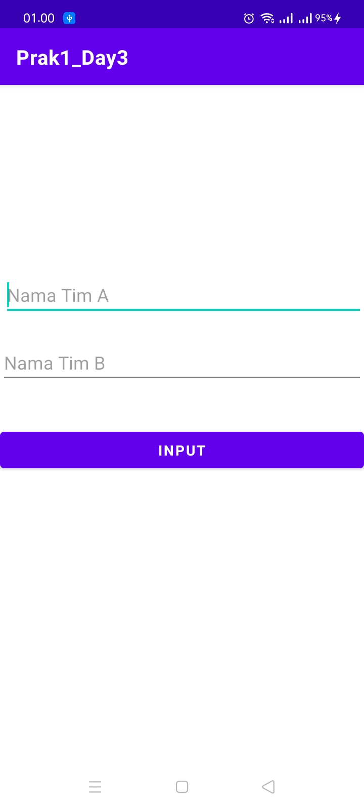
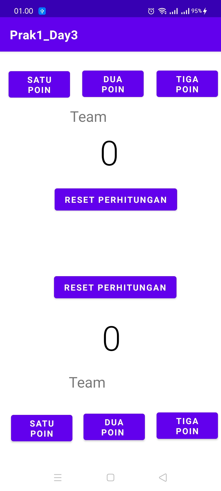

# Prak1Andro_Day3
<b>Praktikum Android Studio #1 Pertemuan 3 (Intent Explisit)</b>

Nama : Dedi Bintang Pamungkas 
Membuat aplikasi skor bola basket
1. Halaman pertama, input nama tim

2. Halaman kedua, Klik tombol poin(1-3) dan reset

